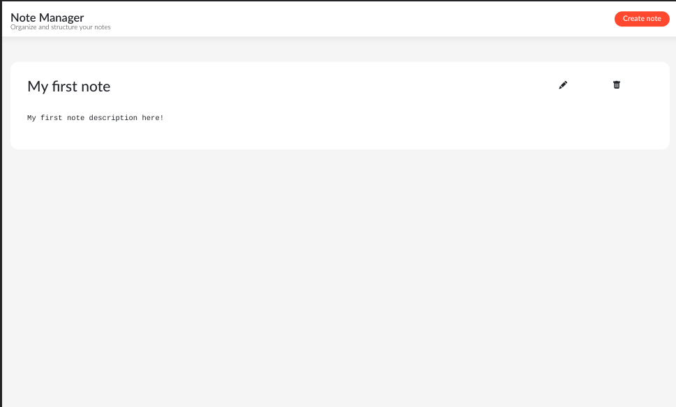

# Learning React application development

## Projects

- 01 - Difficulty picker
- 02 - Tv show advisor
- 03 - Redux intro
- 04 - Note Manager

### Note Manager application `Screenshots`

- Home
  

- Create new note
  

- Note details
  

- Edit note
  

- Search note
  

- Delete note | Confirm deletion
  
  

* Empty
  

## Credit

Happy Coding!!
